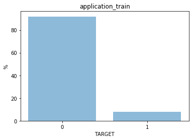
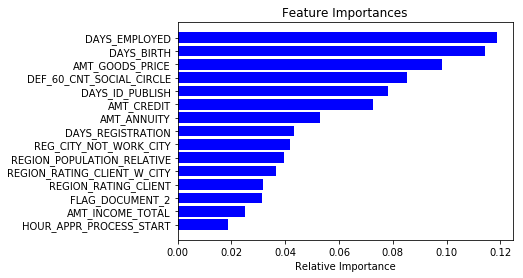
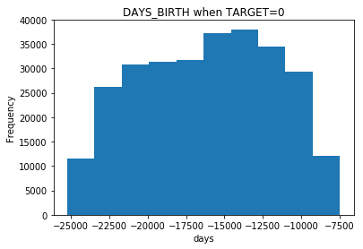
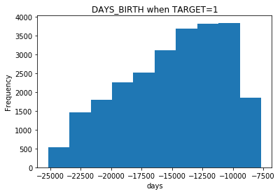

ククルプラソン　チャンヤ 電子情報工学科　3年生

# Home Credit Default Risk

## 提案内容

### スコアリングモデル

application_train.csv のデータを使います。  
データがない（NaN）が5%以上ある説明変数、ラベルの説明変数、残りにNanがある行を使わないようにしました。
また、EXT_SOURCE_{1|2|3}  も使わないようにしました。

学習データは以下に示すように　client with payment difficulties (TARGET=1)　が全体のデータの10%ほどしかない。

だから、モデルを構築するのに学習に使うデータは TARGET=1 のデータを Upsampling して、データの偏りがないようにしました。

RandomForestClassifierを使ってアンサンブルしました。

>RandomForestClassifier(bootstrap=True, class_weight='balanced',
            criterion='gini', max_depth=10, max_features='auto',
            max_leaf_nodes=None, min_impurity_decrease=0.0,
            min_impurity_split=None, min_samples_leaf=1,
            min_samples_split=2, min_weight_fraction_leaf=0.0,
            n_estimators=10, n_jobs=1, oob_score=False, random_state=42,
            verbose=0, warm_start=False)

confusion matrix　は以下になります。

|  Predict | 1   | 0  |
|--:|--------:| ------:|
| 1 | 3306 | 1682 |
| 0 |  19097| 36822 |

最も重要最上位15個の説明変数を以下に示します。

よって、顧客が現在の仕事をする期間、顧客の年齢、が顧客のローン貸し出しを判断するのに重要であることがわかります。

顧客の年齢を見ると信頼できる顧客は年齢が高い傾向があることがわかります。
(daysは誕生日 relative to the application日)

### 利益の検討

confusion matrix　より信頼できない顧客をある程度採用しても、信頼できる顧客の多くが確保できるので、利益を得ることができると思います。
